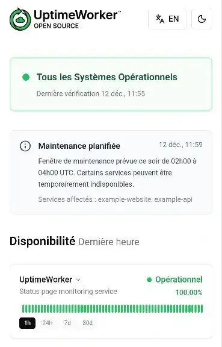
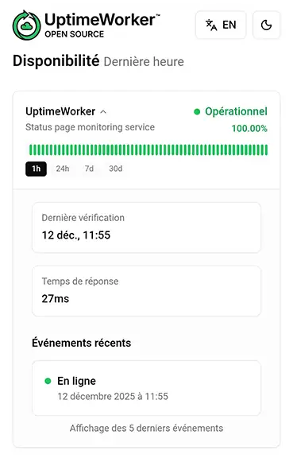

# UptimeWorker

**Systeme de monitoring de page de statut moderne** propulse par Cloudflare Pages + Workers.

[](https://dash.cloudflare.com)
[](https://www.typescriptlang.org/)
[](https://react.dev/)
[](https://vitejs.dev/)

[🌐 Voir la démo](https://uptimeworker.net) | [📖 Documentation détaillée](https://deepwiki.com/UptimeWorker/UptimeWorker) | [English version](./README.md) | [Guide de personnalisation](./CUSTOMIZATION.fr.md)

---

## Captures d'ecran

<p align="center">
  
  
</p>

---

## Fonctionnalites

- **Monitoring temps reel** - Verification automatique toutes les 5 minutes (configurable)
- **Timeline visuelle** - 60 barres avec niveaux de zoom (1h, 24h, 7j, 30j)
- **Stockage historique** - Donnees granulaires 24h + historique journalier 30 jours dans KV
- **Detection HTTP flexible** - Support des plages de codes (200-299, 301, etc.)
- **Statut tri-state** - Operationnel / Degrade / Hors ligne
- **Logique Degrade** - Un monitor passe en `Degrade` si le code HTTP est accepte mais que la reponse reste anormale (actuellement detection de challenge Cloudflare sur reponses HTML/texte, ou temps de reponse >= 4000ms)
- **Maintenance planifiee** - Fenetres actives avec statut bleu dedie
- **Securise** - URLs des monitors jamais exposees au client
- **Multilingue** - Support EN/FR/UK avec systeme i18n extensible
- **Responsive** - Mobile/desktop/tablette
- **Personnalisable** - Logo, titre, couleurs

---

## Architecture

UptimeWorker utilise une **architecture a deux composants**:

```
┌─────────────────────────────────────────────────────────────┐
│                    Cloudflare Pages                         │
│  (Frontend + API)                                           │
│                                                             │
│  • Frontend React (interface page de statut)                │
│  • /api/monitors/status - Retourne les donnees KV           │
│  • /api/cron/check - Endpoint protege pour les checks       │
│  • Binding KV: KV_STATUS_PAGE                               │
└─────────────────────────────────────────────────────────────┘
                           ▲
                           │ POST /api/cron/check
                           │ Header: X-Cron-Auth
                           │
┌─────────────────────────────────────────────────────────────┐
│                 Cloudflare Worker (Cron)                    │
│  (worker-cron/)                                             │
│                                                             │
│  • Declencheur cron toutes les 5 minutes                    │
│  • Appelle l'endpoint /api/cron/check de Pages              │
│  • Variables: SITE_URL, CRON_SECRET                         │
└─────────────────────────────────────────────────────────────┘
```

**Pourquoi cette architecture?**
- Cloudflare Pages ne supporte pas les declencheurs cron
- Un Worker separe gere les taches planifiees
- Communication securisee via secret partage (header X-Cron-Auth)

---

## Demarrage rapide (Developpement local)

### 1. Installation

```bash
git clone https://github.com/UptimeWorker/UptimeWorker.git
cd UptimeWorker
npm install
```

### 2. Configuration

```bash
cp monitors.json.example monitors.json
cp maintenances.json.example maintenances.json
cp .env.example .env
```

Editer `monitors.json`:
```json
[
  {
    "id": "mon-site",
    "name": "Mon Site",
    "url": "https://example.com",
    "method": "GET",
    "acceptedStatusCodes": ["200-299"],
    "degradedCountsAsDown": true,
    "followRedirect": true,
    "linkable": true
  }
]
```

Comportement optionnel par monitor:
- `degradedCountsAsDown: true` (par defaut) fait baisser l'uptime quand le monitor est `degraded`
- `degradedCountsAsDown: false` reactive l'ancien mode tolerant pour ce monitor, donc `degraded` compte encore comme disponible

Comportement important de l'uptime:
- Par defaut, `degraded` fait baisser le pourcentage d'uptime
- Cela rend le pourcentage affiche plus coherent avec un etat orange visible
- `Degraded` avec `100%` ne peut arriver que si tu mets explicitement `degradedCountsAsDown: false`
- Les barres grises / vides de la timeline correspondent a `unknown` / `no data` et ne font pas baisser l'uptime
- L'uptime est calcule seulement sur les vrais checks enregistres, pas sur les periodes sans donnees avant le debut du monitoring

### 3. Lancer

```bash
npm run dev:full
```

Ouvrir http://localhost:3000

---

## Maintenance planifiee

La maintenance planifiee se configure manuellement dans `maintenances.json`.

Comment ca fonctionne:
- L'API lit `maintenances.json`
- Seules les fenetres de maintenance actives **au moment actuel** sont renvoyees au frontend
- Chaque entree active affiche une banniere bleue de maintenance
- Tout monitor liste dans `affectedServices` passe en statut `maintenance` (bleu)

Comportement important:
- Si la maintenance n'a pas encore commence, rien ne s'affiche
- Si la maintenance est terminee, rien ne s'affiche
- Si `affectedServices` contient un id inconnu, la banniere peut s'afficher, mais aucune carte monitor ne passera en bleu
- Le dev local et la production Cloudflare utilisent la meme logique de parsing, donc le comportement reste aligne

Format recommande:
- Utiliser `YYYY-MM-DD` pour les dates
- Utiliser `HH:mm` pour les heures
- Les heures sont interpretees en **UTC**

Exemple:
```json
[
  {
    "id": "maintenance-api",
    "title": {
      "en": "API maintenance in progress",
      "fr": "Maintenance API en cours",
      "uk": "Технічні роботи API тривають"
    },
    "message": {
      "en": "Planned maintenance is in progress. Some services may be temporarily unavailable.",
      "fr": "Une maintenance planifiee est en cours. Certains services peuvent etre temporairement indisponibles.",
      "uk": "Технічні роботи тривають. Деякі сервіси можуть бути тимчасово недоступні."
    },
    "startDate": "2026-03-01",
    "startHour": "02:00",
    "endDate": "2026-03-01",
    "endHour": "04:00",
    "affectedServices": ["google"]
  }
]
```

Compatibilite:
- `startTime` / `endTime` en format ISO complet restent supportes
- `YYYY/MM/DD` est aussi accepte, mais `YYYY-MM-DD` reste le format recommande

---

## Deploiement en production

### Etape 1: Creer le namespace KV

Dans le Dashboard Cloudflare:
1. Aller dans **Workers & Pages > KV**
2. Cliquer **Create a namespace**
3. Nommer (ex: `uptimeworker-status`)

### Etape 2: Deployer le projet Pages

1. **Connecter le repo GitHub** a Cloudflare Pages
2. **Parametres de build:**
   - Build command: `npm run build`
   - Build output directory: `dist`
3. **Variables d'environnement** (Settings > Environment variables):
   - `CRON_SECRET` = votre-cle-secrete (utiliser une chaine aleatoire forte)
   - Variables `VITE_*` selon besoins (voir `.env.example`)
4. **Binding KV** (Settings > Functions > KV namespace bindings):
   - Variable name: `KV_STATUS_PAGE`
   - KV namespace: selectionner votre namespace

### Etape 3: Deployer le Worker Cron

1. Aller dans **Workers & Pages > Create > Create Worker**
2. Nommer (ex: `uptimeworker-cron`)
3. **Coller le code** de `worker-cron/worker.js`
4. **Variables d'environnement** (Settings > Variables):
   - `SITE_URL` = URL de votre Pages (ex: `https://status.example.com`)
   - `CRON_SECRET` = meme secret que le projet Pages
   - `CRON_USER_AGENT` = (optionnel) User-Agent personnalise pour compatibilite WAF
5. **Ajouter le declencheur Cron** (Settings > Triggers > Cron):
   - Utiliser l'onglet **Planification**, mettre **5 minutes**
   - Ou utiliser l'expression: `*/5 * * * *`

### Etape 4: Verifier

1. Attendre la prochaine execution cron (max 5 min)
2. Verifier les logs du Worker pour les evenements `scheduled`
3. Visiter votre URL Pages - les monitors devraient afficher des donnees

---

## Personnalisation

Editer 3 fichiers:

1. **`src/config/branding.ts`** - Nom entreprise, URLs
2. **`.env`** - Titre, chemins logos
3. **`public/`** - Vos fichiers logo

Voir [CUSTOMIZATION.fr.md](./CUSTOMIZATION.fr.md) pour les details.

---

## Internationalisation (i18n)

UptimeWorker supporte plusieurs langues avec un systeme i18n extensible.

### Langues supportees

- 🇬🇧 **Anglais** (en)
- 🇫🇷 **Francais** (fr)
- 🇺🇦 **Ukrainien** (uk)

### Configurer les langues

Editer `.env`:
```bash
# Activer des langues specifiques (separees par virgule)
VITE_ALLOWED_LANGS="en,fr,uk"

# Ou juste anglais et francais
VITE_ALLOWED_LANGS="en,fr"
```

### Ajouter une nouvelle langue

1. **Creer fichier locale** `src/i18n/locales/XX.ts` (XX = code ISO 639-1):
```typescript
import { Translations } from '../translations'

export const xx: Translations = {
  statusPage: 'Votre Traduction',
  // ... copier depuis en.ts et traduire tous les champs
}
```

2. **Importer dans** `src/i18n/translations.ts`:
```typescript
import { xx } from './locales/xx'
const ALL_LOCALES = { en, fr, uk, xx }
```

3. **Activer dans** `.env`:
```bash
VITE_ALLOWED_LANGS="en,fr,uk,xx"
```

### Selecteur de langue

- **≤2 langues**: Bouton toggle simple
- **>2 langues**: Menu deroulant avec noms natifs

### Langues populaires disponibles

Codes ISO 639-1 pour traductions supplementaires:
- `es` - Espagnol (Español)
- `de` - Allemand (Deutsch)
- `it` - Italien (Italiano)
- `pt` - Portugais (Português)
- `ja` - Japonais (日本語)
- `zh` - Chinois (中文)
- `ar` - Arabe (العربية)
- `ru` - Russe (Русский)

---

## Structure du projet

```
uptimeworker/
├── src/
│   ├── components/       # Composants React
│   ├── config/          # Config branding
│   ├── data/            # Donnees incidents
│   └── i18n/            # Traductions
├── functions/           # Cloudflare Pages Functions
│   └── api/
│       ├── cron/check.ts    # Endpoint cron protege
│       └── monitors/status.ts
├── worker-cron/         # Worker Cron separe
│   ├── worker.js        # Code du worker cron
│   ├── wrangler.toml    # Config worker
│   └── .env.example
├── public/              # Assets statiques
├── monitors.json        # Vos services (gitignore)
├── monitors.json.example
├── maintenances.json        # Fenetres de maintenance planifiee (optionnel)
└── maintenances.json.example
```

---

## Securite

- Variables `VITE_*` = PUBLIC (exposees au frontend)
- `CRON_SECRET` = PRIVE (protege l'endpoint /api/cron/check)
- URLs des monitors dans `monitors.json` jamais exposees au client
- L'endpoint cron necessite le header `X-Cron-Auth` correspondant a `CRON_SECRET`

### Protection API (Production)

Si votre page status recoit un trafic public important, vous pouvez proteger l'endpoint `/api/monitors/status` contre les abus externes (bots, scripts, scrapers).

Ajoutez cette protection dans `functions/api/monitors/status.ts`:

```typescript
const userAgent = request.headers.get('User-Agent') || ''
const secFetchSite = request.headers.get('Sec-Fetch-Site')
const secFetchMode = request.headers.get('Sec-Fetch-Mode')
const secFetchDest = request.headers.get('Sec-Fetch-Dest')
const accept = request.headers.get('Accept') || ''

// Bloquer les acces externes (curl, scripts, autres sites, navigation directe)
const hasBrowserHeaders = secFetchSite !== null && secFetchMode !== null
const isSuspiciousUA = /curl|wget|python|httpie|postman|insomnia|axios|node-fetch|got\//i.test(userAgent)
const isNavigating = secFetchMode === 'navigate'
const isDirectNavigation = secFetchDest === 'document' ||
  (isNavigating && accept.includes('text/html')) ||
  (isNavigating && (secFetchDest === 'empty' || !secFetchDest))
const isSameOriginFetch = secFetchSite === 'same-origin' && !isDirectNavigation

if (!hasBrowserHeaders || isSuspiciousUA || !isSameOriginFetch) {
  return new Response(JSON.stringify({ error: 'Access denied' }), {
    status: 403,
    headers: { 'Content-Type': 'application/json' },
  })
}
```

**Ce qui est bloque:**
- `curl`, `wget`, scripts → Pas de headers navigateur
- URL directe dans le navigateur → `Sec-Fetch-Dest: document`
- Requetes cross-site → `Sec-Fetch-Site: cross-site`

**Ce qui est autorise:**
- Votre frontend `fetch()` → Requetes XHR same-origin

---

## Stack technique

- **Frontend:** React 19, TypeScript 5.8, Vite 6, TailwindCSS
- **Backend:** Cloudflare Pages Functions + Workers
- **Storage:** Cloudflare KV
- **Cron:** Cloudflare Worker Cron Triggers

---

## Licence

MIT License - voir [LICENSE](LICENSE)

---

## Support

- **Issues:** [GitHub Issues](https://github.com/UptimeWorker/UptimeWorker/issues)
- **Personnalisation:** [CUSTOMIZATION.fr.md](./CUSTOMIZATION.fr.md)
